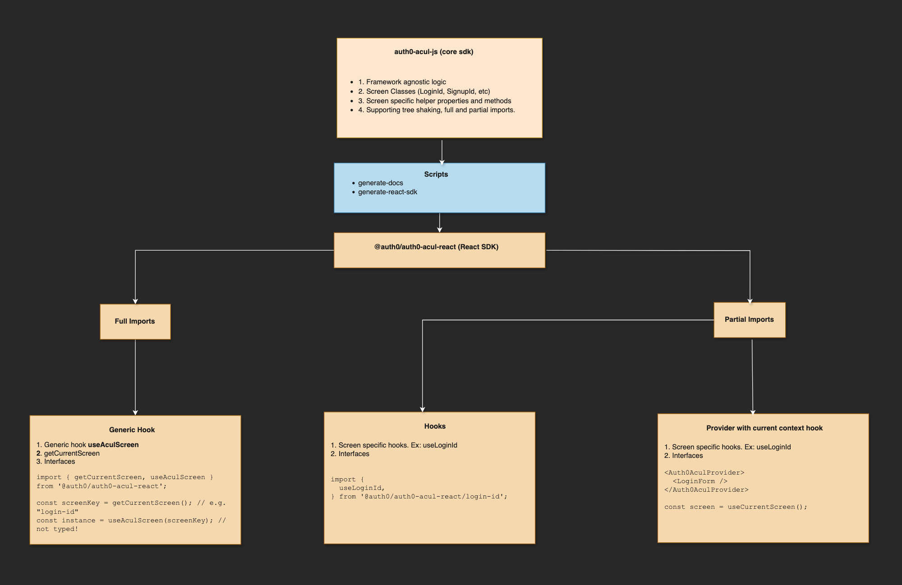

# @auth0/auth0-acul-react

> A React wrapper SDK for building custom [Auth0 Universal Login](https://auth0.com/docs/customize/universal-login-pages) pages using `auth0-acul-js`.

This package provides **typed React hooks**, **providers**, and **interfaces** for customizing individual screens like `login-id`, `signup-id`, `reset-password`, and more — all powered by the vanilla SDK: [`@auth0/auth0-acul-js`](https://www.npmjs.com/package/@auth0/auth0-acul-js).

---

## ✨ Why this SDK?

While [`@auth0/auth0-acul-js`](https://www.npmjs.com/package/@auth0/auth0-acul-js) provides the **core ACUL logic**, it is a **vanilla JavaScript SDK**.

This SDK brings that core power into a familiar React environment:

- ✅ **Hooks-first API** (`useLoginId`, `useSignupPassword`, etc.)
- ✅ **Per-screen Providers** (`Auth0AculProvider`) with `useCurrentScreen`
- ✅ **Typed interfaces** with full IntelliSense and dev safety
- ✅ **Partial imports** for tree-shakable bundles
- ✅ Clean integration with Universal Login via CDN upload

In short: **you write React — we handle the rest.**

---

## 🚀 Installation

```bash
npm install @auth0/auth0-acul-react
```

Peer dependency:
```bash
npm install react
```

---

## 🧱 SDK Structure

| Feature                      | Description                                          |
|------------------------------|------------------------------------------------------|
| 🧩 **Partial Imports**         | Tree-shakable per-screen modules (✅ recommended)     |
| 📦 **Full Import**            | Lightweight helper utilities (optional)             |
| 🎯 **Screen Hooks**           | Instantiates screen classes (e.g. `useLoginId`)     |
| 🧪 **Providers**              | Shares instance via context (e.g. `Auth0AculProvider`) |
| 📚 **Typed Interfaces**       | Provides types for screen props, data, options      |

---

## 🏗 Architecture


This diagram provides an overview of how the `@auth0/auth0-acul-react` SDK integrates with the core `@auth0/auth0-acul-js` library and your React application. Each screen is modular, allowing for partial imports and seamless customization.

## 🧭 How to Use

### ✅ **Recommended: Partial Imports (per screen)**

Each screen has its own hook, provider, and types.

#### Example: `login-id`

```tsx
import {
  useLoginId,
  Auth0AculProvider,
  useCurrentScreen
} from '@auth0/auth0-acul-react/login-id';

// ✅ Option 1: Hook-only
const screen = useLoginId();
screen.login({ identifier: 'john@example.com', password: '1234' });

// ✅ Option 2: Provider + context hook
<Auth0AculProvider>
  <LoginForm />
</Auth0AculProvider>

const screen = useCurrentScreen(); // typed as LoginId
```

#### ✅ Interfaces for Type Safety

```ts
import type {
  LoginIdOptions,
  LoginIdProperties,
  LoginIdScreenData
} from '@auth0/auth0-acul-js/login-id';
```

---

### ⚠️ Full Import (optional utilities only)

```ts
import { getCurrentScreen, useAculScreen } from '@auth0/auth0-acul-react';

const screenKey = getCurrentScreen(); // e.g. "login-id"
const instance = useAculScreen(screenKey); // not typed!
```

> Use only if you're dynamically determining screen type at runtime.
> Prefer partial imports for better typing and smaller bundles.

---

## 📊 Full vs Partial Imports

| Feature                     | Full Import                      | ✅ Partial Import                  |
|----------------------------|----------------------------------|------------------------------------|
| Tree-shaking               | ❌ Includes all screens           | ✅ Only what you use               |
| Type Inference             | ❌ Not typed                      | ✅ Fully typed                     |
| DX / IntelliSense          | ❌ Limited                        | ✅ Rich completion + hints        |
| Bundle Size                | ❌ Larger                         | ✅ Minimal                         |
| Use Case                   | Rare fallback or util-only use   | ✅ Day-to-day development          |

✅ **Partial import is the default and recommended pattern.**

---

## 📁 File Structure (Simplified)

```
src/
  hooks/
    login-id.tsx
    signup-id.tsx
    ...
  index.ts               # full import entry
  utils/
docs/
  screens/               # autogenerated markdown docs
```

---

## 🛠️ Customizing Screens

To customize a screen:

1. Know your screen type: `login-id`, `signup-id`, `reset-password`, etc.
2. Use the matching hook + types
3. Build and deploy to CDN
4. Update Auth0 with your custom asset URLs

---

## 📚 Docs

Per-screen usage documentation is available in [`docs/screens`](../docs/screens) and is auto-generated.

Example:
- [`docs/screens/login-id.md`](../docs/screens/login-id.md)

---

## 📦 Related Packages

| Package                     | Description                            |
|-----------------------------|----------------------------------------|
| [`@auth0/auth0-acul-js`](https://npmjs.com/package/@auth0/auth0-acul-js) | Core JS SDK (framework-agnostic)    |
| `@auth0/auth0-acul-react`   | ✅ This React wrapper SDK               |
| `@auth0/auth0-acul-vue`     | Vue wrapper (coming soon)              |
| `@auth0/auth0-acul-angular` | Angular wrapper (coming soon)          |
| `@auth0/auth0-acul-svelte`  | Svelte wrapper (coming soon)           |
